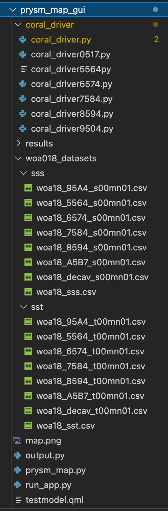
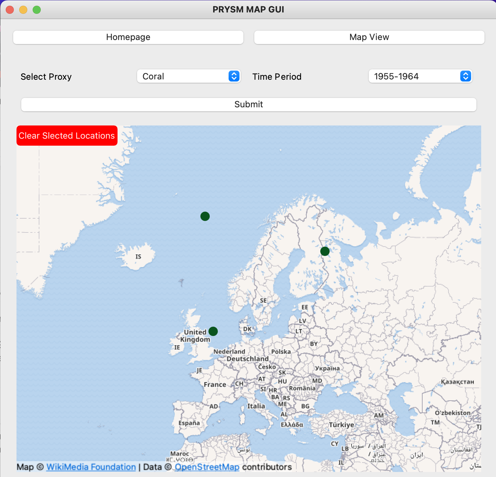
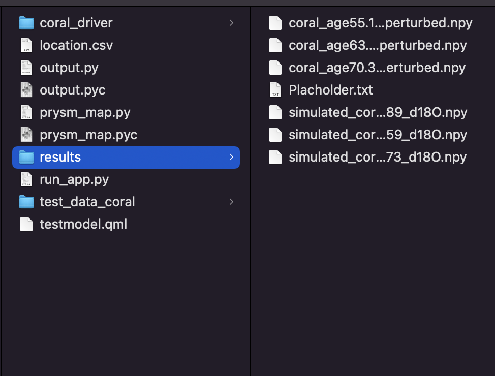
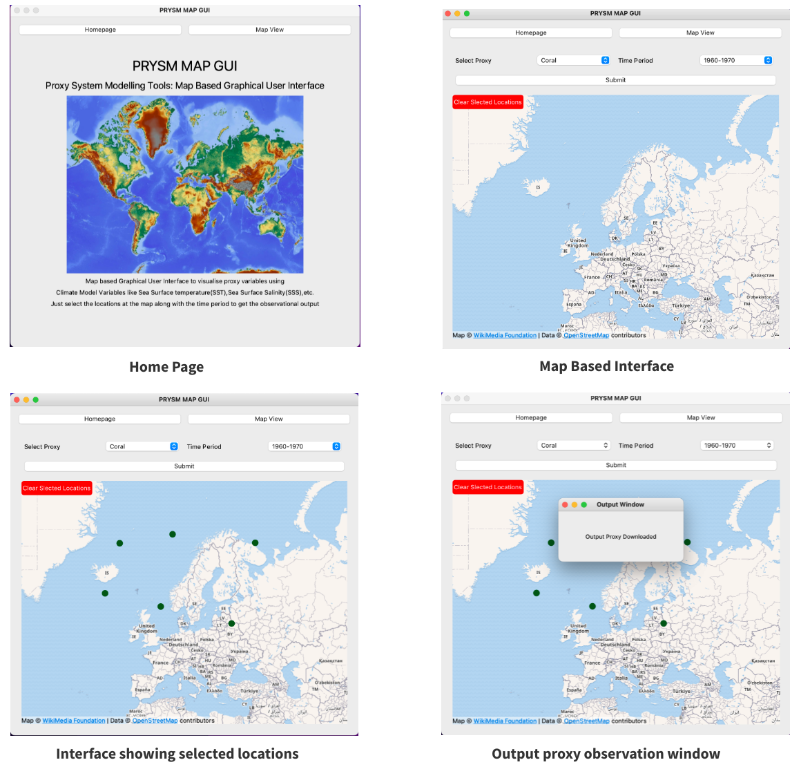

# PRYSM Map GUI (PRYSM Map Graphical User Interface)


PRYSM Map GUI is the extension of existing PRYSM [1] application (https://github.com/sylvia-dee/PRYSM). This application aims to make the proxy forward modeling process easier for researchers enabling them just to select the time period and multiple location coordinates and get the outout proxy data as results.

Introduction
---------------------------
PRYSM Map GUI is extended upon the source code of https://github.com/sylvia-dee/PRYSM/tree/v0.1. A new folder "prysm_map_gui" is added to the codebase and complete work of development of graphical user interface and integration has been carried out in this folder.

Folder Structure (prysm_map_gui)
---------------------------



1. coral_driver: This folder contains the driver script to run coral proxy model with the extracted longitude and latitude values and collected input SST and SSS datasets for different timeperiods. It consists of 6 driver scripts to run the proxy model for 6 different time periods(1954-1965, 1965-1974, 1975-1894, 1895-2004, 2005-2017) datasets of SST and SSS.
2. results: This is the folder where the result output proxy is obtained. The result output proxy is saved as coral_age_"latitude_value"_perturbed.csv and simulated_coral_"latitude_value"_d18O.csv. One can simply double check the latitude for which position they had clicked on map interface and hence get the required data.
3. woa18_datasets: This folder consists of the datasets collected from World Ocean Atlas 2018 for Sea Surface Temperature(SST)[3] and Sea Surface Salinity (SSS) [2] for 6 decadal periods.
a. sss: sss is a sub folder which consists of .csv files for Sea Surface Salinity [2] for time periods 1954-1965, 1965-1974, 1975-1894, 1895-2004, and 2005-2017 respectively. These have been downloaded from: https://www.ncei.noaa.gov/access/world-ocean-atlas-2018/bin/woa18.pl?parameter=s with the paramters : csv format, 1 degree grid, statistical mean, and data for each decadal periods.
b. sst: sst is a sub folder which consists of .csv files for Sea Surface Temperature [3] for time periods 1954-1965, 1965-1974, 1975-1894, 1895-2004, and 2005-2017 respectively. These have been downloaded from: https://www.ncei.noaa.gov/access/world-ocean-atlas-2018/bin/woa18.pl?parameter=t with the paramters : csv format, 1 degree grid, statistical mean, and data for each decadal periods.
4. output.py: pyside2 file to generate output observation window
5. prysm_map.py: consists of the GUI creation logic 
6. run_app.py: the main file which runs the graphical user interface: (Entry point of GUI)
7. testmodel.qml: qml file which has the logic for embedded map interface


Installation Guide:
---------------------------

Please make sure that you are using Python v2.7 to run this application.
   
1. cd to the PRYSM directory:      
  ```
  cd PRYSM
  ```
2. Activate your virtual environment for python
  ```
	pip install virtualenv
  python -m virtualenv PRYSM
  source PRYSM/bin/activate
  ```

3. Install the required dependencies:
  ```
  pip install numpy scipy PySide2 matplotlib
  ```
 
4. Download the psm dependencies:
  ```
  python setup.py install
  ```
  
   Alternately, you can use pip: 
      
  ```
  pip install git+https://github.com/sylvia-dee/PRYSM.git
  ```
  
  Either method will add a module named 'psm' to your default lib/python2.7/site-packages/                          directory.

  If you lack root access:  
  ```
  python setup.py install --user
  ```

Example of running the application locally:
--------------------------------------------

1. Be inside prysm_map_gui directory and run the application:
  ```
  cd prysm_map_gui
  python run_app.py
  ```
  This opens a graphical user interface (PRYSM Map GUI).

2. In the GUI click the Map View and select the time period and multiple location at map interfaces as below:


3. Finally, click submit button on GUI. This displays a output proxy downloaded window. Now navigate to results folder which is present in prysm_map_gui directory. Here, one can see all the downloaded output proxy data for the selected locations.


## Final Implemented GUI


References:

1. Dee, S., & Burroughs, B. M. (2015). PRYSM (v0.1) [Proxy System Modeling Application]. Github. https://github.com/sylvia-dee/PRYSM

2. Zweng, M. M., J. R. Reagan, D. Seidov, T. P. Boyer, R. A. Locarnini, H. E. Garcia, A. V. Mishonov, O. K. Baranova, K. Weathers, C. R. Paver, and I. Smolyar, 2018. World Ocean Atlas 2018, Volume 2: Salinity. A. Mishonov Technical Ed.; NOAA Atlas NESDIS 82, 50pp

3. Locarnini, R. A., A. V. Mishonov, O. K. Baranova, T. P. Boyer, M. M. Zweng, H. E. Garcia, J. R. Reagan, D. Seidov, K. Weathers, C. R. Paver, and I. Smolyar, 2018. World Ocean Atlas 2018, Volume 1: Temperature. A. Mishonov Technical Ed.; NOAA Atlas NESDIS 81, 52pp.

4. Sylvia G Dee, James M Russell, Carrie Morrill, Zihan Chen, and Ashling Neary. PRYSM v2. 0: A proxy system model for lacustrine archives. Paleoceanography and Paleoclimatology, 33(11):1250–1269, 2018.


